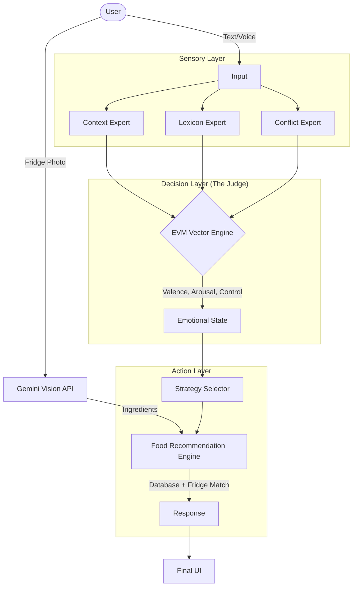

# 🧠 MoodBite.Ai (v3.0)
> **The Offline-First Sensory Food Interface**

[](https://moodbiteai.vercel.app/)
[](https://opensource.org/licenses/MIT)
[](https://github.com/singhcod3r)

**MoodBite** is a sophisticated emotional regulation system that uses culinary intervention to balance human mood states. Unlike generic AI wrappers, it runs on a custom **Deterministic Emotional Vector Machine (EVM)**, allowing for high-precision, offline emotion detection and reasoning.

🌐 **Live Demo:** [https://moodbiteai.vercel.app/](https://moodbiteai.vercel.app/)

---

## 🏛️ Architectural Diagram

The core of MoodBite v3.0 relies on an "Expert Panel" architecture where multiple specialized logic modules vote on the user's state before a final "Judge" determines the emotional vector.



---

## 🎨 Design Model

MoodBite follows a **3-Layer Sensory Design Philosophy**:

1.  **The Sensory Surface (UI)**:
    *   **Glassmorphism**: Built with `backdrop-filter`, `bg-white/6`, and deep gradients to mimic a futuristic dashboard.
    *   **Dynamic Backgrounds**: The environment shifts colors (Red for Anger, Blue for Grief) based on real-time vector analysis.
    *   **Interactive Input**: Supports **Voice Command** (Web Speech API) and **Vision** (Upload Fridge Photos).

2.  **The Expert Core (Logic)**:
    *   **Offline-First**: 90% of the logic (Emotion detection, Reasoning, Food matching) runs locally without external API calls.
    *   **Deterministic**: Same input = Same output. No hallucinations.
    *   **Explainable AI**: The system generates a "Chef's Note" explaining *why* a specific food regulates a specific mood.

3.  **The Vision Layer (Integration)**:
    *   Integrates **Google Gemini 1.5 Flash** to analyze refrigerator contents and cross-reference them with the emotional strategy.

---

## 🛠️ Implementation & Tech Stack

*   **Framework**: [Next.js 15](https://nextjs.org/) (React 19)
*   **Styling**: [Tailwind CSS v4](https://tailwindcss.com/) + Framer Motion
*   **AI (Vision)**: Google Gemini 1.5 Flash
*   **AI (Core)**: Custom JS-based Expert System (No LLM dependency for logic)
*   **Image Gen**: Pollinations.ai (Real-time food visualization)

### Directory Structure
```bash
├── components/       # UI Building Blocks (ModernInputBar, HeroFoodCard)
├── evm/             # The Brain (Expert Vector Machine)
│   ├── dictionaries.js  # 28-Emotion Lexicon
│   ├── experts.js       # Signal Processors
│   ├── judge.js         # Vector Math & Decision Logic
│   └── foodEngine.js    # Strategy & Recipe Database
├── pages/           # Routes (Home, About, API)
└── public/          # Static Assets
```

---

## 🔄 Deployment Workflow

The project is configured for seamless deployment on **Vercel**.

### GitHub Actions Workflow (CI/CD)
*While Vercel handles deployments automatically, here is the logic flow for a standard CI pipeline:*

```yaml
name: MoodBite Build Pipeline
on: [push]

jobs:
  build:
    runs-on: ubuntu-latest
    steps:
      - uses: actions/checkout@v4
      - name: Install Dependencies
        run: npm ci
      - name: Lint Analysis
        run: npm run lint
      - name: Production Build
        run: npm run build
      - name: Test Offline Engine
        run: node evm/test_suite.js
```

---

## 🚀 Getting Started

1.  **Clone the Repo**
    ```bash
    git clone https://github.com/singhcod3r/MoodBite-Version-2.0.git
    cd MoodBite-Version-2.0
    ```

2.  **Install Dependencies**
    ```bash
    npm install
    # or
    yarn install
    ```

3.  **Set Environment Variables**
    Create a `.env.local` file:
    ```env
    GEMINI_API_KEY=your_gemini_key_here
    ```

4.  **Run Development Server**
    ```bash
    npm run dev
    ```

5.  **Open Browser**
    Visit `http://localhost:3000`.

---

### © 2025 MoodBite Project
Designed & Engineered by **[Ayush Singh](https://github.com/singhcod3r)**.
